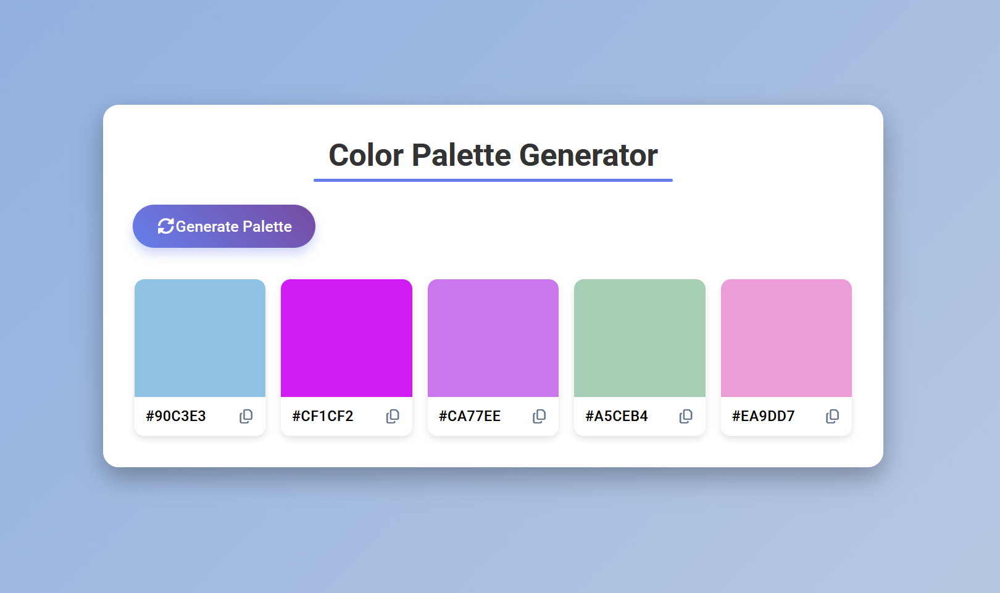

# 🎨 Color Palette Generator

Un générateur interactif de palettes de couleurs aléatoires.
Ce projet a été développé avec **HTML**, **CSS**, et **JavaScript** pur, sans dépendances lourdes, pour offrir une interface simple, esthétique et intuitive.

---

## 🚀 Aperçu du projet

Le **Color Palette Generator** permet de :

- Générer aléatoirement 5 couleurs hexadécimales ;
- Visualiser instantanément les couleurs sur des cartes individuelles ;
- Copier une couleur en un clic (soit sur le carré coloré, soit sur l’icône de copie) ;
- Obtenir une animation visuelle lors de la copie réussie (icône de ✅).

---

## 🧩 Structure du projet

```
📁 color-palette-generator
│
├── index.html          # Structure principale du site
├── style.css           # Mise en forme et design visuel
└── script.js           # Logique dynamique et interactions
```

---

## 🖋️ Explication du code

### 🧱 1. HTML – Structure de base

Le fichier `index.html` définit :

- Une **section principale** `.container` contenant le titre, le bouton de génération et la grille de couleurs ;
- Cinq **boîtes de couleur** (`.color-box`) comportant :

  - un carré coloré (`.color`) ;
  - une ligne d’informations affichant :

    - la valeur **hexadécimale** de la couleur (`.hex-value`) ;
    - une **icône de copie** (Font Awesome).

**Extrait clé :**

```html
<div class="color-box">
  <div class="color" style="background-color: #e1f5fe;"></div>
  <div class="color-info">
    <span class="hex-value">#e1f5fe</span>
    <i class="far fa-copy copy-btn" title="Copy to clipboard"></i>
  </div>
</div>
```

---

### 🎨 2. CSS – Style et mise en page

Le fichier `style.css` donne au projet une apparence **moderne et responsive**, grâce à :

- Un **fond en dégradé** (`linear-gradient(135deg, #83a8df, #c3cfe2)`) ;
- Un conteneur central avec **ombre portée et bords arrondis** ;
- Une **grille fluide** de 5 boîtes de couleur (`grid-template-columns: repeat(auto-fit, minmax(130px, 1fr))`) ;
- Des **animations au survol** pour rendre l’interface plus vivante.

**Points notables :**

```css
#generate-btn {
  background: linear-gradient(45deg, #667eea, #764ba2);
  border-radius: 50px;
  cursor: pointer;
}

.color-box:hover {
  transform: translateY(-5px);
}
```

---

### ⚙️ 3. JavaScript – Logique fonctionnelle

Le fichier `script.js` gère **la génération des couleurs** et **les interactions utilisateur**.

#### 🔁 a. Génération aléatoire

La fonction `getRandomColor()` crée un code hexadécimal aléatoire :

```js
function getRandomColor() {
  const letters = "0123456789ABCDEF";
  let color = "#";
  for (let i = 0; i < 6; i++) {
    color += letters[Math.floor(Math.random() * 16)];
  }
  return color;
}
```

#### 🎨 b. Mise à jour de la palette

Chaque couleur générée est appliquée dynamiquement à une boîte :

```js
function updatePaletteDisplay(colors) {
  const colorBoxes = document.querySelectorAll(".color-box");
  colorBoxes.forEach((box, index) => {
    const color = colors[index];
    box.querySelector(".color").style.backgroundColor = color;
    box.querySelector(".hex-value").textContent = color;
  });
}
```

#### 📋 c. Fonction de copie

Lorsqu’on clique sur une icône ou un carré, la couleur est copiée dans le presse-papier grâce à l’API `navigator.clipboard`.

Une animation visuelle (changement d’icône et couleur verte) confirme la réussite :

```js
function showCopySuccess(element) {
  element.classList.replace("fa-copy", "fa-check");
  element.style.color = "green";
  setTimeout(() => {
    element.classList.replace("fa-check", "fa-copy");
    element.style.color = "";
  }, 1000);
}
```

#### 🪄 d. Génération initiale

Une palette est automatiquement créée à l’ouverture de la page :

```js
generatePalette();
```

---

## 💡 Fonctionnalités principales

| Fonction           | Description                               |
| ------------------ | ----------------------------------------- |
| 🎲 Génération      | Crée 5 couleurs hexadécimales aléatoires  |
| 📋 Copie rapide    | Copie le code hex par clic                |
| ✅ Feedback visuel | Animation de validation après la copie    |
| 📱 Responsive      | Mise en page fluide sur mobile et desktop |
| 💅 Design moderne  | Dégradés, ombres et transitions douces    |

---

## 🧠 Technologies utilisées

- **HTML5** → structure du contenu
- **CSS3 (Grid, Flexbox, transitions)** → design et mise en page
- **JavaScript (ES6)** → logique dynamique et API Clipboard
- **Font Awesome** → icônes interactives

---

## 👨‍💻 Auteur

**Jean Martial Gahoussou (JWulfran)**<br>
🎓 Étudiant MBA | 💼 Business Analyst & Data Developer<br>
📍 Québec, Canada<br>
🌐 [Portfolio](https://github.com/JWulfran) | [LinkedIn](https://www.linkedin.com/in/jean-martial-gahoussou)

---

## 🪶 Licence

Ce projet est distribué sous licence MIT – libre d’utilisation, de modification et de distribution à des fins éducatives.

---

### 📸 Aperçu

`
