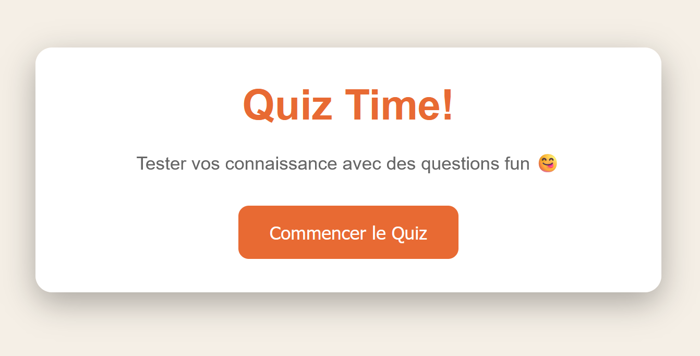

markdown

# 🎯 Quiz Game – Application Web Interactive

Un mini jeu de **quiz dynamique** réalisé en **HTML, CSS et JavaScript pur**, conçu pour tester les connaissances de l’utilisateur à travers une série de questions amusantes et éducatives.  
L’application gère automatiquement les écrans de démarrage, de jeu et de résultats, tout en affichant la progression et le score en temps réel.

---

## 🧩 Structure du projet

```

📁 Quiz-Game/<br>
│<br>
├── index.html        → Structure principale de l’application <br>
├── style.css         → Mise en forme et styles responsives <br>
└── script.js         → Logique du jeu (JavaScript interactif) <br>

```

---

## 💡 Fonctionnalités principales

| Fonctionnalité                        | Description                                                                           |
| ------------------------------------- | ------------------------------------------------------------------------------------- |
| **Écran d’accueil**                   | Présente le titre du jeu, une courte description et un bouton pour commencer le quiz. |
| **Affichage dynamique des questions** | Les questions sont générées à partir d’un tableau d’objets en JavaScript.             |
| **Système de score**                  | Le score est mis à jour à chaque bonne réponse et affiché en direct.                  |
| **Barre de progression**              | Indique visuellement l’avancement du joueur dans le quiz.                             |
| **Feedback visuel immédiat**          | Les réponses correctes s’affichent en vert ✅, les mauvaises en rouge ❌.             |
| **Écran de résultats**                | Affiche le score final, un message personnalisé et un bouton pour recommencer.        |
| **Design responsive**                 | S’adapte automatiquement aux écrans mobiles et tablettes.                             |

---

## 🏗️ 1. Structure HTML (`index.html`)

Le fichier **HTML** définit la structure visuelle de l’application à travers **trois écrans principaux** :

### 🔹 A. Écran d’accueil (`#start-screen`)

```html
<div class="screen active" id="start-screen">
  <h1>Quiz Time!</h1>
  <p>Tester vos connaissances avec des questions fun 😋</p>
  <button id="start-btn">Commencer le Quiz</button>
</div>
```

- Présente le jeu et contient le bouton de démarrage.

### 🔹 B. Écran du quiz (`#quiz-screen`)

- Affiche les questions, les réponses possibles et la barre de progression.
- Contient :

  - le texte de la question (`#question-text`)
  - le conteneur des réponses (`#answers-container`)
  - les informations de score et de progression (`#current-question`, `#score`)
  - la **progress bar** animée.

### 🔹 C. Écran des résultats (`#result-screen`)

- Présente le score final et un message motivant.
- Permet de **relancer le quiz** via le bouton `#restart-btn`.

---

## 🎨 2. Feuille de style (`style.css`)

Le CSS définit un design **moderne, lisible et minimaliste** :

### 🌈 Principaux styles :

- **Palette de couleurs :**

  - Orange principal `#e86a33` → boutons et éléments actifs.
  - Beige clair `#f8f0e5` → fond neutre et agréable.
  - Gris doux `#666` et `#333` pour le texte.

- **Effets visuels :**

  - `box-shadow` pour donner du relief.
  - `hover` sur les boutons et réponses.
  - Transitions douces pour les changements d’état.

- **Classes importantes :**

  | Classe                        | Rôle                                                 |
  | ----------------------------- | ---------------------------------------------------- |
  | `.screen`                     | Définit les écrans du jeu (masqués par défaut).      |
  | `.active`                     | Rend l’écran visible.                                |
  | `.answer-btn`                 | Style des boutons de réponses.                       |
  | `.correct` / `.incorrect`     | Couleur verte/rouge selon la validité de la réponse. |
  | `.progress-bar` / `.progress` | Barre d’avancement animée.                           |

- **Responsive Design :**

  - Adaptation automatique sous `500px` : police réduite, padding ajusté.

---

## ⚙️ 3. Logique JavaScript (`script.js`)

Le **JavaScript** contrôle toute l’interactivité du jeu : affichage, score, navigation, et logique de quiz.

### 🔧 Variables clés :

```js
let currentQuestionIndex = 0;
let score = 0;
let answersDisabled = false;
```

### 📚 Structure des questions :

```js
const quizQuestions = [
  {
    question: "What is the capital of France?",
    answers: [
      { text: "London", correct: false },
      { text: "Paris", correct: true },
      ...
    ]
  },
  ...
];
```

Chaque question contient :

- un **texte de question** ;
- un tableau d’**objets réponses** (texte + booléen `correct`).

---

### 🧠 Fonctions principales :

| Fonction              | Description                                                                                               |
| --------------------- | --------------------------------------------------------------------------------------------------------- |
| `startQuiz()`         | Réinitialise le score et démarre le quiz.                                                                 |
| `showQuestion()`      | Affiche la question actuelle et crée dynamiquement les boutons de réponse.                                |
| `selectAnswer(event)` | Vérifie la réponse sélectionnée, colore les boutons, met à jour le score et passe à la question suivante. |
| `showResults()`       | Affiche l’écran des résultats et un message selon la performance.                                         |
| `restartQuiz()`       | Redémarre le quiz depuis le début.                                                                        |

### 🏁 Progression :

Une **barre d’avancement** évolue en fonction du numéro de la question :

```js
const progressPercent = (currentQuestionIndex / quizQuestions.length) * 100;
progressBar.style.width = progressPercent + "%";
```

### 💬 Messages finaux personnalisés :

En fonction du score :

```js
if (percentage === 100) "Perfect! You're a genius!";
else if (percentage >= 80) "Great job!";
else if (percentage >= 60) "Good effort!";
else if (percentage >= 40) "Not bad!";
else "Keep studying!";
```

---

## 🧪 Exemple d’exécution

1. L’utilisateur clique sur **Commencer le Quiz**.
2. Les questions s’affichent une par une.
3. À chaque clic :

   - Les boutons se colorent (vert/rouge),
   - Le score s’actualise,
   - La barre de progression avance.

4. En fin de quiz, le joueur voit son **score final** et un **message motivant**.
5. Il peut **rejouer** via le bouton “Recommencer”.

---

## 🚀 Améliorations possibles

- [ ] Ajouter un **minuteur** pour chaque question.
- [ ] Mélanger les questions aléatoirement.
- [ ] Ajouter un mode “difficulté” (facile, moyen, difficile).
- [ ] Sauvegarder les scores dans le **localStorage**.
- [ ] Permettre à l’utilisateur de **choisir un thème** (clair/sombre).
- [ ] Ajouter une **base de données** (API) pour stocker les scores.

---

## 👨‍💻 Auteur

**Jean Martial Gahoussou (JWulfran)**<br>
🎓 Étudiant MBA | 💼 Business Analyst & Data Developer<br>
📍 Québec, Canada<br>
🌐 [Portfolio](https://github.com/JWulfran) | [LinkedIn](https://www.linkedin.com/in/jean-martial-gahoussou)

---

## 🪶 Licence

Ce projet est distribué sous licence MIT – libre d’utilisation, de modification et de distribution à des fins éducatives.

---

### 📸 Aperçu

`
